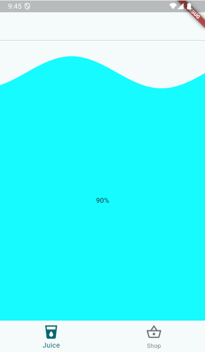
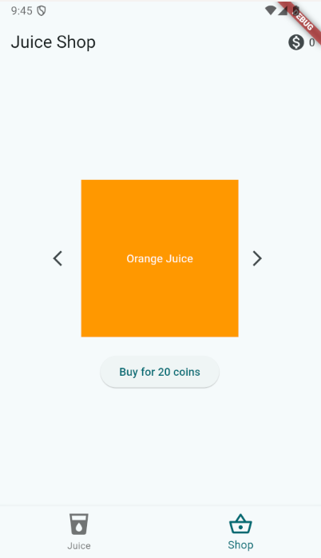
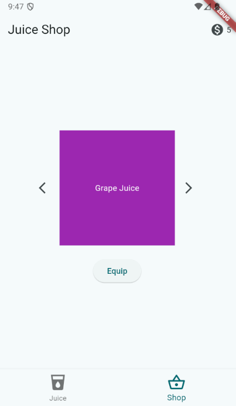
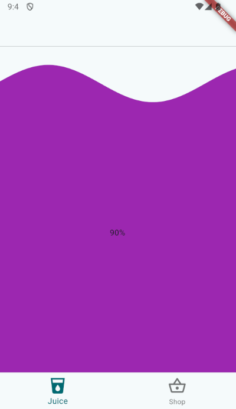

# Juice-Drinker

Juice Drinker is a fun and interactive mobile app that simulates the experience of drinking various juices while encouraging theoretical hydration and rewarding users.

## Audience

This app is designed for:
- Casual gamers who enjoy simple, engaging mobile experiences
- People looking for a fun way to track and encourage their liquid intake
- Anyone who wants a playful distraction during their day

## What the App Does

Juice Drinker allows users to:
1. Choose from a variety of virtual juices
2. "Drink" the juice by tilting their phone
3. Earn coins for finishing their drinks
4. Purchase new juice flavors in the in-app shop

The app uses the device's sensors to detect tilting, creating a realistic drinking simulation. As users finish their juices, they earn coins which can be used to unlock new flavors, adding a collecting and progression element to the game.

## Why It's Useful

Juice Drinker offers several benefits:
1. **Encourages Hydration**: By gamifying the act of drinking, it can help remind and motivate users to stay hydrated throughout the day.
2. **Provides Entertainment**: It's a fun, casual game that can be played in short bursts, perfect for quick breaks or while waiting.
3. **Teaches Basic Economics**: The coin system and shop introduce simple concepts of earning and spending virtual currency.
4. **Demonstrates Sensor Usage**: Showcases practical use of device sensors in a mobile app.

## Screenshots

*Screenshot 1: Main Juice Drinking Screen*
Description: Show the main screen with a juice glass and the tilt mechanic.

*Screenshot 2: Shop Page*
Description: Display the shop interface where users can see available juices and their prices.

*Screenshot 3: Juice Selection*
Description: Showcase the variety of juices available in the app and how to equip them once purchased.

*Screenshot 4: Grape Juice*
Description: Showcases just one of the different juice options that a user can purchase with their coins.

## How to Play

1. Select a juice from your inventory or purchase a new one from the shop.
2. Tilt your phone as if you're drinking from a glass to "drink" the juice.
3. Try to finish the juice to earn coins.
4. Use earned coins to buy new juice flavors in the shop.
5. Collect all the juices and enjoy the variety of colors and flavors!

---

Enjoy your virtual juices and happy hydrating!
